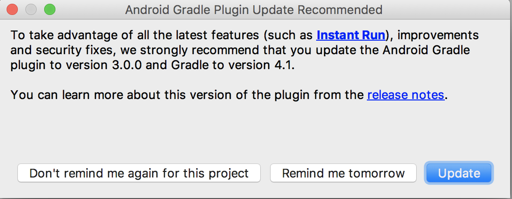
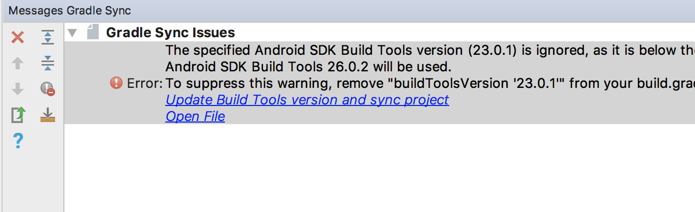
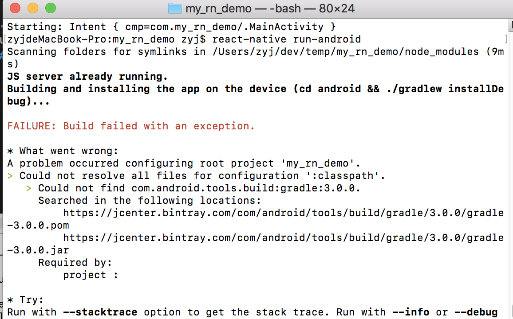

使用React Native开发Android手持机
------------------------------
#### Android手持机
1. 手持机型号iData95W，版本为Android4.4.2，有读RFID和扫条码的模块。
2. RFID模块用到了厂商提供的jar包和so文件。
3. 扫条码模块用的是广播的方式。
#### 技术栈
1. react native 与原生Android的交互，js端调用native端，native端主动发消息给js端。
2. Android调用RFID与扫码模块。
2. react-native-keyevent，这个dependencies是用于监听手持机的按键事件，以调用native端的读取RFID方法。

## 前置准备
1. 环境配置，开发环境的配置ReactNative官网有详细的[教程](https://reactnative.cn/docs/0.51/getting-started.html#content)
2. 用数据线连接PC和Android手持机(使用adb devices查看是否连接成功)，并确保PC与手持机在同一wifi下。
3. react-native init my_rn_demo
4. cd my_rn_demo & react-native run-android
5. run-android后会出现红屏，"Unable to load script from assets..."，很正常，因为此手持机版本是Android 4.4.2，需要设置Debug server host & port for device来访问开发服务器，Android 5.0以上则可以使用adb reverse命令。按menu键或摇晃手持机即可进入开发菜单，在Dev Settings -> Debug server host & port for device中输入PC的ip和8081端口即可，如192.168.0.154:8081。然后重新运行react-native run-android即可。
6. 用Android Studio打开android目录后，会提醒你更新Gradle Plugin，此处按提示更新即可

7. Android Studio的Gragle Plugin更新好后，我们重新运行react-native run-android却发现报错了

这个报错很好解决，在build.gradle(android目录下有两个build.gradle，此处为project的)中添加google()就好了，[stackoverflow](https://stackoverflow.com/questions/47446681/react-native-run-android-could-not-find-com-android-tools-buildgradle3-0-1/47456492#47456492)有详细解释，可能是react-native-cli的bug，代码如下：
    
        buildscript {
            repositories {
                jcenter()
                google()
            }
            dependencies {
                classpath 'com.android.tools.build:gradle:3.0.0'
            }
        }

8. 添加RFID的jar包和so文件，分别添加到app/libs/RFIDScan.jar和app/src/main/jniLibs/armeabi-v7a/librfid.so，此处要注意armeabi-v7a目录要与build.gradle(Module:app)的dedefaultConfig->ndk->abiFilters一致。
    
        defaultConfig {
            applicationId "com.my_rn_demo"
            minSdkVersion 16
            targetSdkVersion 22
            versionCode 1
            versionName "1.0"
            ndk {
                abiFilters "armeabi-v7a", "x86"
            }
        }

## Talk is cheap, show me the code
js端与native端的通讯，官方提供的方法是创建一个继承自ReactContextBaseJavaModule的原生模块并注册，就能在js端调用对应的方法了。native端也能通过这个module主动发消息给js端。[官网教程](https://facebook.github.io/react-native/docs/native-modules-android.html)

1. 在android对应目录下创建一个module继承自ReactContextBaseJavaModule

        ...

        public class DemoModule extends ReactContextBaseJavaModule{

            RfidControll rfidControll = new RfidControll();
            private BroadcastReceiver iDataScanReceiver;
            private IntentFilter iDataIntentFilter;
            private static final String RES_ACTION = "android.intent.action.SCANRESULT";
            private static final String KEY_BARCODE_ENABLESCANNER_ACTION = "android.intent.action.BARCODESCAN";
            public static final String KEY_OUTPUT_ACTION = "android.intent.action.BARCODEOUTPUT";

            public DemoModule(ReactApplicationContext reactContext) {
                super(reactContext);
                rfidControll.OpenComm();
                initScan();
            }

            //getName用于返回Module名给js端，js端能用NativeModules.ScanAndRfidDemo访问到这个模块
            @Override
            public String getName() {
                return "ScanAndRfidDemo";
            }

            //通过RCTDeviceEventEmitter发送消息到js端
            private void sendEvent(ReactContext reactContext,
                                String eventName,
                                @Nullable WritableMap params) {
                reactContext.getJSModule(DeviceEventManagerModule.RCTDeviceEventEmitter.class)
                        .emit(eventName, params);
            }

            /*
            * 读取RFID
            * */
            int res = 0;

            @ReactMethod
            public void readCardUid() {
                byte[] uid = new byte[4];
                byte[] pdata = new byte[1];
                pdata[0] = 0x00;
                byte buffer[] = new byte[256];
                res = rfidControll.API_MF_Request(0, 0x26, buffer);
                if (res == 0) {
                    res = rfidControll.API_MF_Anticoll(0, pdata, buffer);
                    if (res == 0) {
                        System.arraycopy(buffer, 0, uid, 0, 4);
                        WritableMap params = Arguments.createMap();
                        params.putString("RfidResult", getDec(uid));
                        sendEvent(getReactApplicationContext(), "iDataRfid", params);
                    }
                }
            }

            private String getDec(byte[] bytes) {
                long result = 0;
                long factor = 1;

                for (int i = 0; i < bytes.length; i++) {
                    long value = bytes[i] & 0xffl;
                    result += value * factor;
                    factor *= 256l;
                }
                return String.valueOf(result);
            }

            @ReactMethod
            public void closeComm() {
                rfidControll.CloseComm();
            }

            /*
            * 调用扫码头
            * */
            private void initScan(){
                //扫描结果的意图过滤器的动作一定要使用"android.intent.action.SCANRESULT"
                iDataIntentFilter = new IntentFilter(RES_ACTION);
                //注册广播接收者
                iDataScanReceiver = new ScannerResultReceiver();
                getReactApplicationContext().registerReceiver(iDataScanReceiver, iDataIntentFilter);
                open();
                enablePlayBeep(false);
                setOutputMode(1);
            }

            private class ScannerResultReceiver extends BroadcastReceiver{
                @Override
                public void onReceive(Context context, Intent intent) {
                    if (intent.getAction().equals(RES_ACTION)){
                        final String scanResult = intent.getStringExtra("value");

                        WritableMap params = Arguments.createMap();
                        params.putString("ScanResult", scanResult);
                        sendEvent(getReactApplicationContext(), "iDataScan", params);
                    }
                }
            }

            @ReactMethod
            public void openScanner(){
                open();
            }

            @ReactMethod
            public void colseScanner(){
                close();
            }

            //扫码头供电
            private void open(){
                Intent intent = new Intent(KEY_BARCODE_ENABLESCANNER_ACTION);
                intent.putExtra(KEY_BARCODE_ENABLESCANNER_ACTION, true);
                getReactApplicationContext().sendBroadcast(intent);
            }

            //扫码头断电
            public void close(){
                Intent intent = new Intent(KEY_BARCODE_ENABLESCANNER_ACTION);
                intent.putExtra(KEY_BARCODE_ENABLESCANNER_ACTION, false);
                getReactApplicationContext().sendBroadcast(intent);
            }

            private void setOutputMode(int mode){
                Intent intent = new Intent(KEY_OUTPUT_ACTION);
                intent.putExtra(KEY_OUTPUT_ACTION, mode);
                getReactApplicationContext().sendBroadcast(intent);
            }

            private void enablePlayBeep(boolean enable){
                Intent intent = new Intent("android.intent.action.BEEP");
                intent.putExtra("android.intent.action.BEEP", enable);
                getReactApplicationContext().sendBroadcast(intent);
            }
        }

2. 创建一个reactPackage，implements ReactPackage，实现接口方法

        ...

        public class DemoReactPackage implements ReactPackage{
            @Override
            public List<NativeModule> createNativeModules(ReactApplicationContext reactContext) {
                List<NativeModule> modules = new ArrayList<>();
                modules.add(new DemoModule(reactContext));
                return modules;
            }

            @Override
            public List<ViewManager> createViewManagers(ReactApplicationContext reactContext) {
                return Collections.emptyList();
            }
        }

3. 将reactPackage加进MainApplication.java

        ...

        public class MainApplication extends Application implements ReactApplication {

        private final ReactNativeHost mReactNativeHost = new ReactNativeHost(this) {
            ...
            @Override
            protected List<ReactPackage> getPackages() {
            return Arrays.<ReactPackage>asList(
                new MainReactPackage(),
                new KeyEventPackage(),
                new DemoReactPackage()
            );
            }

            ...
        };

        ...
        }

4. 添加react-native-keyevent

        1. yarn add react-native-keyevent
        2. react-native link react-native-keyevent

        ...

        public class MainActivity extends ReactActivity {

            ...

            @Override
            public boolean onKeyDown(int keyCode, KeyEvent event) {
                KeyEventModule.getInstance().onKeyDownEvent(keyCode, event);
                return super.onKeyDown(keyCode, event);
            }

            @Override
            public boolean onKeyUp(int keyCode, KeyEvent event) {
                KeyEventModule.getInstance().onKeyUpEvent(keyCode, event);
                return super.onKeyUp(keyCode, event);
            }
        }

5. js端调用与监听native模块

        ...

        import React, { Component } from 'react';
        import {
        ...
        NativeModules,
        DeviceEventEmitter
        } from 'react-native';

        export default class App extends Component {
        componentWillMount() {
            //通过使用DeviceEventEmitter模块来监听事件
            DeviceEventEmitter.addListener('iDataRfid', function (Event) {
            alert(Event.RfidResult);
            });
            DeviceEventEmitter.addListener('iDataScan', function (Event) {
            alert(Event.ScanResult);
            });
        }

        componentDidMount() {
            //监听按键事件
            KeyEvent.onKeyDownListener((keyEvent) => {
            if(keyEvent.keyCode == 139 || keyEvent.keyCode == 140 || keyEvent.keyCode == 141){
                NativeModules.ScanAndRfidDemo.readCardUid();
            }
            });

            KeyEvent.onKeyUpListener((keyEvent) => {
            console.log(keyEvent)
            });
        }

        componentWillUnmount() {
            NativeModules.ScanAndRfidDemo.closeComm();
            KeyEvent.removeKeyDownListener();
            KeyEvent.removeKeyUpListener();
        }

        render() {
            return (
            ...
            );
        }
        }
